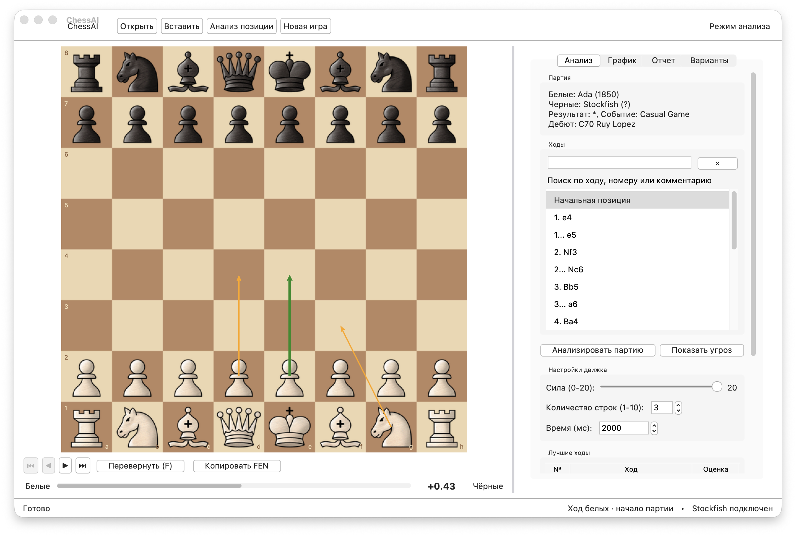

<div align="center">

# ♟️ ChessAI

### Настольный шахматный анализатор, тренер и PGN-инструментарий на базе Stockfish

[](https://www.python.org/)
[](https://stockfishchess.org/)
[](#interface)
[](#requirements)
[](LICENSE)

Загрузите партию, найдите ошибки, изучите варианты движка и превратите слабые ходы в тренировочные позиции — в одном локальном приложении.

[Быстрый старт](#quick-start) · [Возможности](#features) · [Горячие клавиши](#hotkeys) · [Stockfish](#stockfish)

</div>

---

<a id="interface"></a>
## 🖼️ Интерфейс



<p align="center"><sub>Нативное окно macOS · изменяемая боковая панель · анализ Stockfish</sub></p>

На macOS ChessAI использует системную тему Aqua, шрифты, цвета и контролы. На новых версиях macOS приложение автоматически получает актуальное системное оформление, включая Liquid Glass, без рисованной имитации blur-эффектов.

<a id="features"></a>
## ✨ Возможности

### 🔍 Анализ

- Быстрый анализ текущей позиции через Stockfish.
- Несколько лучших линий движка (`MultiPV`) с оценкой и стрелками на доске.
- Полный разбор партии: точность, `ACPL`, зевки, ошибки и переломный момент.
- Определение дебюта и построение интерактивного графика оценки.
- Клик по графику мгновенно переносит к соответствующему полуходу.
- Пакетный анализ всех партий из одного PGN-файла.

### 📥 Импорт и экспорт

- Локальные `PGN`-файлы, включая файлы с несколькими партиями.
- `PGN`, `FEN` или URL прямо из буфера обмена.
- Партии по ссылкам Lichess и Chess.com, а также прямые ссылки на `.pgn`.
- Сохранение аннотированного PGN и копирование `PGN`/`FEN`.

### 🧠 Тренировка

- Игра против Stockfish с настраиваемой силой.
- Задача «найди лучший ход» для текущей позиции.
- Автоматическая генерация тренировочных задач из ошибок партии.
- Режим тренера с контекстными подсказками.

### 🧩 Работа с партией

- Поиск по ходам, номерам, комментариям и аннотациям.
- `NAG`-метки (`!`, `?`, `!!`, `??`, `!?`, `?!`) и текстовые комментарии.
- Добавление вариантов из анализа, перенос варианта в главную линию и удаление веток.
- Переключаемые координаты, звуки, анимация и режим «только доска».
- Изменяемая по ширине боковая панель: перетаскивается сама непрерывная серая граница.

<a id="quick-start"></a>
## 🚀 Быстрый старт

### 1. Клонируйте репозиторий

```bash
git clone https://github.com/ReNothingg/ChessAI.git
cd ChessAI
```

### 2. Создайте виртуальное окружение

<details open>
<summary><strong>macOS / Linux</strong></summary>

```bash
python3 -m venv .venv
source .venv/bin/activate
python -m pip install -r requirements.txt
```

</details>

<details>
<summary><strong>Windows PowerShell</strong></summary>

```powershell
py -m venv .venv
.venv\Scripts\Activate.ps1
python -m pip install -r requirements.txt
```

</details>

### 3. Запустите ChessAI

```bash
python main.py
```

> [!TIP]
> На Windows бинарник `stockfish.exe` уже находится в репозитории. На macOS и Linux ChessAI также ищет `stockfish` в `PATH` и стандартных каталогах установки.

<a id="requirements"></a>
## ⚙️ Требования

| Компонент | Требование |
|---|---|
| Python | `3.9+` |
| GUI | `tkinter` |
| Движок | Stockfish |
| ОС | macOS, Windows или Linux |

Если Stockfish не найден, интерфейс всё равно запустится. Функции движка, полного анализа и тренировок будут отключены до настройки пути.

<a id="stockfish"></a>
## 🛠️ Настройка Stockfish

ChessAI ищет движок в следующем порядке:

1. путь из переменной окружения `STOCKFISH_PATH`;
2. `stockfish.exe` в корне проекта на Windows;
3. `stockfish` в корне проекта или в `PATH` на macOS/Linux;
4. стандартные каталоги Homebrew и MacPorts на macOS.

<details>
<summary><strong>Указать путь вручную</strong></summary>

macOS / Linux:

```bash
export STOCKFISH_PATH=/path/to/stockfish
python main.py
```

Windows PowerShell:

```powershell
$env:STOCKFISH_PATH = "C:\path\to\stockfish.exe"
python main.py
```

</details>

## 🧭 Типичный сценарий

1. Откройте PGN, вставьте FEN или загрузите партию по URL.
2. Перемещайтесь по партии клавишами `←` и `→` или через список ходов.
3. Нажмите «Анализ позиции», чтобы увидеть лучшие продолжения.
4. Запустите полный анализ для расчёта точности, `ACPL` и ключевых ошибок.
5. Изучите отчёт и кликабельный график оценки.
6. Создайте тренировочную сессию из найденных ошибок.

<a id="hotkeys"></a>
## ⌨️ Горячие клавиши

| Клавиши | Действие |
|---|---|
| `←` / `→` | Предыдущий / следующий ход |
| `Home` / `End` | Начало / конец партии |
| `A` | Анализ текущей позиции |
| `T` | Показать угрозу |
| `P` | Задача «найди лучший ход» |
| `F` | Перевернуть доску |
| `Space` | Режим «только доска» |
| `Ctrl/Cmd + O` | Открыть PGN |
| `Ctrl/Cmd + F` | Поиск по ходам |
| `Ctrl/Cmd + B` | Показать / скрыть боковую панель |
| `H` | Справка |

Двойной клик по строке в блоке «Лучшие ходы» добавляет продолжение как вариант.

## 🧱 Структура проекта

```text
ChessAI/
├── app/
│   ├── app.py              # состояние приложения и запуск компонентов
│   ├── ui.py               # нативный интерфейс и отрисовка доски
│   ├── game.py             # PGN/FEN, навигация и игровой поток
│   ├── analysis.py         # анализ Stockfish и тренировки
│   ├── interaction.py      # мышь, клавиатура и варианты
│   ├── openings.py         # определение дебютов
│   └── reporting.py        # отчёты и тренировочные позиции
├── assets/                 # доска, фигуры, звуки и скриншоты
├── engine_handler.py       # управление процессом Stockfish
├── config.py               # настройки и пути
├── main.py                 # точка входа
└── requirements.txt
```

## 🧰 Технологии

| Технология | Назначение |
|---|---|
| [`python-chess`](https://python-chess.readthedocs.io/) | правила шахмат, PGN и FEN |
| [Stockfish](https://stockfishchess.org/) | анализ позиций |
| `tkinter` / `ttk` | нативный desktop UI |
| [`matplotlib`](https://matplotlib.org/) | график оценки |
| [Pillow](https://python-pillow.org/) | изображения доски и фигур |
| [`requests`](https://requests.readthedocs.io/) | загрузка партий по URL |
| [`pygame`](https://www.pygame.org/) | звуки ходов |

## 🩺 Решение проблем

<details>
<summary><strong>Stockfish не найден</strong></summary>

Проверьте, что бинарник существует, имеет право на запуск и путь к нему указан в `STOCKFISH_PATH`. На macOS/Linux можно проверить командой `stockfish` в терминале.

</details>

<details>
<summary><strong>Нет звука</strong></summary>

Приложение продолжит работать без аудио. Проверьте установленный `pygame` и доступность звукового устройства, затем перезапустите ChessAI.

</details>

<details>
<summary><strong>Не запускается tkinter</strong></summary>

Убедитесь, что используемая сборка Python включает Tcl/Tk. Это особенно важно для минимальных Linux-установок.

</details>

## 🤝 Участие в разработке

Issues и pull request'ы приветствуются. Перед отправкой изменений:

```bash
python -m unittest discover -v
```

Старайтесь сохранять нативное поведение интерфейса на каждой ОС и добавлять тесты для логики, не зависящей от GUI.

## 📄 Лицензия

Проект распространяется по лицензии [MIT](LICENSE).

<div align="center">

Сделано для разбора партий, а не борьбы с интерфейсом. ♟️

</div>
